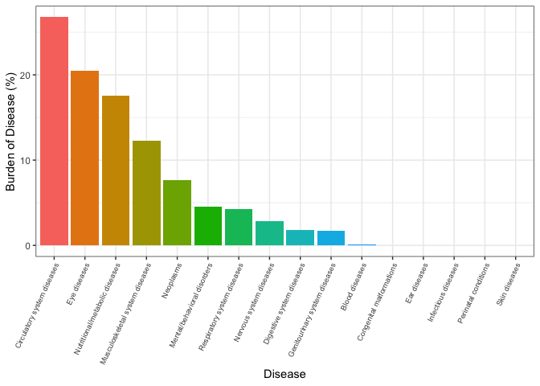
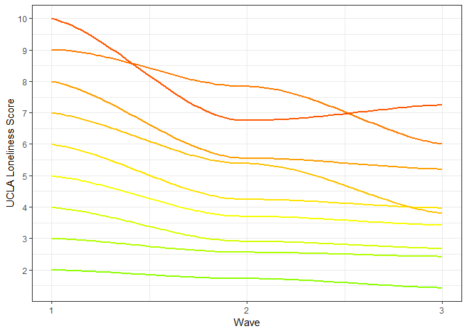
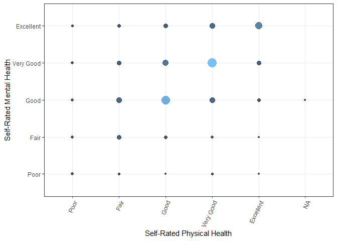

Final Report
================
December 6th, 2018

Analysis of a Longitudinal Study on Aging Conducted in Ireland
==============================================================

#### Diana Ballesteros (deg2163), Christopher Crowe (clc2229), Tanvi Jain (tj2383)

Motivation:

This project aims to look at the effect of sociodemographic indicators on physical and mental health among a cohort of Irish residents aged 50+ years old.

Related work:

This project is a broad examination of the implications of aging on physical and mental health. The inspiration for this analysis was drawn from the group members research interests including depression, aging, and chronic diseases. The following link to a page from the American Psychological Association was used as a reference for the variables we chose to analyze. <https://www.apa.org/helpcenter/aging-depression.aspx>

Questions:

-   Is physical health associated with mental health?
-   Does loneliness change over time among widowed men?
-   What is the proportion of various ICD-10 diseases among this population?

Evolution of questions:

As we created the graphs we decided to also explore variations according to sex (male and female) and different marital statuses (widowed, married, divorced, cohabitating, separated, and single). For some graphs, we also explored the change over waves 1, 2, and 3.

Evolution of methods:

In our initial proposal we wanted to look at `Quality of Life`. However, the nature of this variable seemed ambiguous to us so instead we looked at variables such as `self-rated mental health`, `self-rated physical health`, and `loneliness` as proxies for quality of life. We also planned to use a hexagonal heat map to visualize the relationship between physical and mental health, but according to the distribution of our data this map was not visually informative. Instead we used a geom\_count to display the concentrations of data within a scatterplot.

Loading the necessary libraries:

``` r
knitr::opts_chunk$set(echo = FALSE)
library(tidyverse)
library(plotly)
library(MASS)
library(googledrive)
library(httr)

## The MASS package also has a select function, so we need to specify that when we call the select function, we are referring to select from the dplyr package.
select = dplyr::select
```

Instructions for importing the data:

Download the data from Google Drive to your local R environment (this requires you to sign into your Google account) then reference the data from a local path. The R console may provide you with a link to authenticate your Google account. If so, copy and paste this link into your browser and log into your Google account. After logging in, Google may successfully link to R and you can continue working in R as usual. However, after loggin in, Google may provide you with a authentication code. If so, copy and paste this code into your R console when prompted and continue working in R as usual.

Tidying the data:

The following code creates a number of functions to clean variables that are used in our analyses. It also tidies the data and prepares dataframes to be used for visualizations.

Data source:

The data was obtained from The Irish Longitudinal Study on Ageing (TILDA) Waves 1, 2, and 3. Here is a link to the dataset <https://www.icpsr.umich.edu/icpsrweb/ICPSR/series/726>. To access information (e.g. codebooks) on this website, you will need to create a free account. We did not delete any participants from our dataset to ensure completeness of our code, in case a participant who is null right now responds in a future wave. The sample size for each wave (1, 2, 3) was n =8504, n = 7207, and n = 6400, respectively. Not all participants who were in Wave 1 were a part of Waves 2 and 3 (i.e. they were lost to follow up).

Exploratory analysis

The code below shows how we created visualizations in a Shiny dashboard. We used `shiny` to stratify the plots by various combinations of sex, marital status, and time. We provide select examples for each type of plot below. If you would like to view the full results of our exploratory visualizations and analyses, please refer to the Shiny Data Visualizations and Shiny Data Analysis tabs on our website.

-   Shiny Sidebar:

-   Bar Graph -- Proportion of Incident Disease Burden in Wave 3 Attributable to Specified Disease:

In this plot we calculated the sum of people who had each ICD-10 disease in wave 3 in order to calculate the proportion of people with each disease, allowing us to visualize the burden of each disease in this population. We used our functions to clean the values for variables of interest, and we then created a bar graph to show the proportions and ordered the bars according to decreasing burden. We focused only on Wave 3 for this graph because we were interested in only visualizing the incident diseases in the most recent data collection phase. We also incorporated a color scale to depict the different burdens (with red corresponding to the most burdensome disease category).

-   Example - Married males:



-   Spaghetti Plot - Trends in Loneliness Scores by Baseline Loneliness Scores:

We started by renaming the loneliness variables from each wave so that we could identify which wave they correspond to after merging the three waves together by ID. Again, we used our functions to clean the values under the variables of interest. We then created a spaghetti plot to show the change in loneliness across waves. A large change we made once we saw our original chaotic plot was that we decided to depict the different trends across waves for each baseline loneliness value (scale from 1-10). Although there is no one at loneliness 0 we kept this in our code for future replication of this code in future studies, if a participant were to respond as 0 at baseline. We created separate datasets for each loneliness value at baseline using a for loop. The resulting spaghetti plot shows the trend across waves by baseline loneliness values. We also incorporated a color grid to depict the different trends (with red corresponding to the highest, worst value of 10).

-   Example - Married males:

<!-- -->

    ## Warning: Computation failed in `stat_smooth()`:
    ## x has insufficient unique values to support 10 knots: reduce k.

    ## Warning: Computation failed in `stat_smooth()`:
    ## x has insufficient unique values to support 10 knots: reduce k.

    ## Warning in simpleLoess(y, x, w, span, degree = degree, parametric =
    ## parametric, : pseudoinverse used at 0.99

    ## Warning in simpleLoess(y, x, w, span, degree = degree, parametric =
    ## parametric, : neighborhood radius 2.01

    ## Warning in simpleLoess(y, x, w, span, degree = degree, parametric =
    ## parametric, : reciprocal condition number 2.046e-15

    ## Warning in simpleLoess(y, x, w, span, degree = degree, parametric =
    ## parametric, : There are other near singularities as well. 4.0401

    ## Warning in simpleLoess(y, x, w, span, degree = degree, parametric =
    ## parametric, : pseudoinverse used at 0.99

    ## Warning in simpleLoess(y, x, w, span, degree = degree, parametric =
    ## parametric, : neighborhood radius 2.01

    ## Warning in simpleLoess(y, x, w, span, degree = degree, parametric =
    ## parametric, : reciprocal condition number 1.1939e-15

    ## Warning in simpleLoess(y, x, w, span, degree = degree, parametric =
    ## parametric, : There are other near singularities as well. 4.0401

    ## Warning in simpleLoess(y, x, w, span, degree = degree, parametric =
    ## parametric, : pseudoinverse used at 0.99

    ## Warning in simpleLoess(y, x, w, span, degree = degree, parametric =
    ## parametric, : neighborhood radius 2.01

    ## Warning in simpleLoess(y, x, w, span, degree = degree, parametric =
    ## parametric, : reciprocal condition number 1.5555e-16

    ## Warning in simpleLoess(y, x, w, span, degree = degree, parametric =
    ## parametric, : There are other near singularities as well. 4.0401

    ## Warning in simpleLoess(y, x, w, span, degree = degree, parametric =
    ## parametric, : pseudoinverse used at 0.99

    ## Warning in simpleLoess(y, x, w, span, degree = degree, parametric =
    ## parametric, : neighborhood radius 2.01

    ## Warning in simpleLoess(y, x, w, span, degree = degree, parametric =
    ## parametric, : reciprocal condition number 5.9131e-16

    ## Warning in simpleLoess(y, x, w, span, degree = degree, parametric =
    ## parametric, : There are other near singularities as well. 4.0401

    ## Warning in simpleLoess(y, x, w, span, degree = degree, parametric =
    ## parametric, : pseudoinverse used at 0.99

    ## Warning in simpleLoess(y, x, w, span, degree = degree, parametric =
    ## parametric, : neighborhood radius 2.01

    ## Warning in simpleLoess(y, x, w, span, degree = degree, parametric =
    ## parametric, : reciprocal condition number 7.0409e-17

    ## Warning in simpleLoess(y, x, w, span, degree = degree, parametric =
    ## parametric, : There are other near singularities as well. 4.0401

    ## Warning in simpleLoess(y, x, w, span, degree = degree, parametric =
    ## parametric, : pseudoinverse used at 0.99

    ## Warning in simpleLoess(y, x, w, span, degree = degree, parametric =
    ## parametric, : neighborhood radius 2.01

    ## Warning in simpleLoess(y, x, w, span, degree = degree, parametric =
    ## parametric, : reciprocal condition number 1.0173e-16

    ## Warning in simpleLoess(y, x, w, span, degree = degree, parametric =
    ## parametric, : There are other near singularities as well. 4.0401

    ## Warning in simpleLoess(y, x, w, span, degree = degree, parametric =
    ## parametric, : pseudoinverse used at 0.99

    ## Warning in simpleLoess(y, x, w, span, degree = degree, parametric =
    ## parametric, : neighborhood radius 2.01

    ## Warning in simpleLoess(y, x, w, span, degree = degree, parametric =
    ## parametric, : reciprocal condition number 7.4014e-17

    ## Warning in simpleLoess(y, x, w, span, degree = degree, parametric =
    ## parametric, : There are other near singularities as well. 4.0401

    ## Warning in simpleLoess(y, x, w, span, degree = degree, parametric =
    ## parametric, : pseudoinverse used at 0.99

    ## Warning in simpleLoess(y, x, w, span, degree = degree, parametric =
    ## parametric, : neighborhood radius 1.01

    ## Warning in simpleLoess(y, x, w, span, degree = degree, parametric =
    ## parametric, : reciprocal condition number 0

    ## Warning in simpleLoess(y, x, w, span, degree = degree, parametric =
    ## parametric, : There are other near singularities as well. 4.0401

    ## Warning in simpleLoess(y, x, w, span, degree = degree, parametric =
    ## parametric, : pseudoinverse used at 0.99

    ## Warning in simpleLoess(y, x, w, span, degree = degree, parametric =
    ## parametric, : neighborhood radius 2.01

    ## Warning in simpleLoess(y, x, w, span, degree = degree, parametric =
    ## parametric, : reciprocal condition number 5.2085e-17

    ## Warning in simpleLoess(y, x, w, span, degree = degree, parametric =
    ## parametric, : There are other near singularities as well. 4.0401



-   Count Plot - Self-Rated Physical vs. Mental Health Status:

We created a count plot for self-rated physical vs. mental health status. In this graph, points with larger circles represent a larger number of responses. We can see that many individuals self-reported having the same status for both physical and mental health.

-   Example - Married males, Wave 3:



-   Preliminary chi-Squared test of independence:

The code below calcualtes the observed and expected cell counts for the tabulation of self-rated mental health and self-rated physical health for all individuals in Wave 3. We chose to focus on Wave 3 becuase we were interested in only the most recent phase of data collection. After examining the observed and expected counts, we also calculated the chi-squared test statistic, degrees of freedom, and corresponding p-value.

Below are the observed cell counts.

|           |  Poor|  Fair|  Good|  Very Good|  Excellent|
|-----------|-----:|-----:|-----:|----------:|----------:|
| Poor      |    37|    17|    10|          5|          3|
| Fair      |    65|   249|   137|         51|          6|
| Good      |    51|   372|  1268|        403|         60|
| Very Good |    35|   191|   519|       1315|        185|
| Excellent |    15|    69|   168|        324|        631|

Below are the expected cell counts.

|           |       Poor|       Fair|       Good|  Very Good|  Excellent|
|-----------|----------:|----------:|----------:|----------:|----------:|
| Poor      |   2.362755|   10.45199|   24.46557|   24.41901|   10.30068|
| Fair      |  16.670546|   73.74458|  172.61817|  172.28969|   72.67701|
| Good      |  70.685742|  312.68865|  731.92822|  730.53540|  308.16198|
| Very Good |  73.672001|  325.89880|  762.84998|  761.39832|  321.18089|
| Excellent |  39.608956|  175.21597|  410.13805|  409.35758|  172.67944|

Below are the results of the chi-squared test of independence.

|  chi\_stat|   df|  p\_value|
|----------:|----:|---------:|
|   4078.847|   16|         0|

Additional Anaylses

-   Additional chi-squared tests of independence (stratified):

Based on the results from the preliminary analysis, we decided to run additional tests within specific subsets of our population using `Shiny`.

Discussion:

-   Graph 1:

Our hypothesis for this plot was more broad in that we expected the largest burden of disease to come from chronic diseases, simply because the cohort is older and in Ireland, which may not have a high prevalence of infectious, or perinatal diseases and conditions. The bar graph specified that the 4 diseases with the highest proportion were circulatory system diseases, eye diseases, nutritional/metabolic diseases, and musculoskeletal system diseases. As predicted there were no incident cases of infectious diseases or perinatal conditions. Additionally, there were no cases of congenital malformations, ear diseases, or skin conditions. Interestingly, across sex, we noticed that the most prevalent disease among men was circulatory system diseases but among women it was nutritional/metabolic diseases.

-   Graph 2:

Based on research suggesting that women are better equipped to rebuild social networks after the loss of a partner, we expected that loneliness scores would increase over time for widowed men more than widowed women. However, according to graph 2, this was not the case. Most widowed men tended to exhibit a decrease in loneliness scores compared to baseline (indicative of declines in feelings of loneliness), whereas widowed women stayed at relatively the same loneliness level across all waves with the exception of an an outlier at level 8 loneliness.

-   Graph 3:

We anticipated that physical health and mental health would be correlated and from graph 3 we discovered that this was true. Those who felt they had better physical health also had better mental health and vice versa. We also found a larger concentration of older adults reporting `Very Good` or `Good` physical and mental health. This trend remained consistent across sex and over time. While this means that there was minimal improvement in physical and mental health over time, it also means there was a minimal decline in physical and mental health over time.

-   Preliminary chi-Squared test of independence:

Since our graph depicted a correlation between self-rated mental health and physical health we anticipated an association. Our null hypothesis was that there is no association between self-rated mental health and physical health and the alternate hypothesis was that there is an association between self-rated mental health and physical health. We set alpha to 0.05 and calculated the chi-squared test statistic (4078.8) and p-value (0), which was significant. At the 5% level of significance, there is enough evidence to reject the null hypothesis and conclude that there is an association between mental health and physical health, which matches graph 1.

-   Additional chi-squared tests of independence:

Based on these results, we used `Shiny` to further stratify the analysis to explore the association between self-rated mental health and physical health within specific subsets of our study population. At the 5% level of significance, among married females in wave 1, there is enough evidence to reject the null hypothesis and conclude that there is an association between mental health and physical health.
